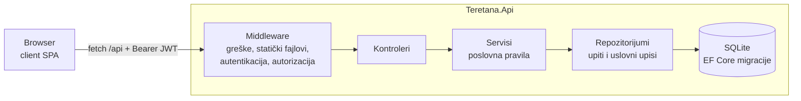
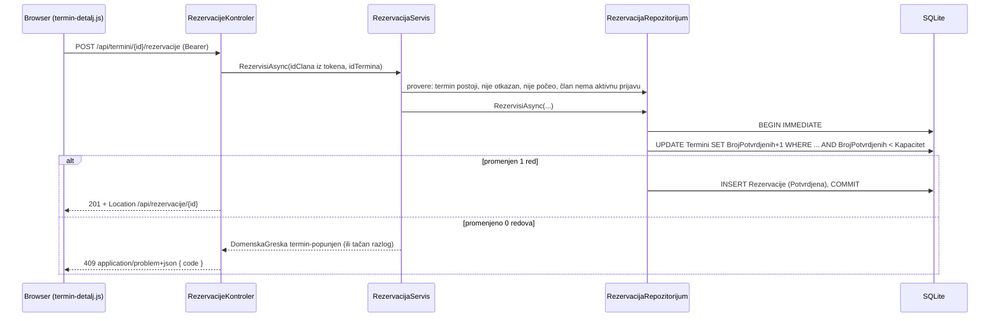
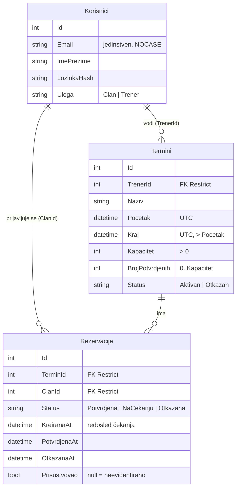

# ARHITEKTURA

Ovaj dokument opisuje kako je aplikacija za rezervaciju termina u teretani organizovana, kako teku podaci i
zašto su donete ključne odluke. Uputstvo za pokretanje je u `README.md`, a strategija testiranja u `TEST-PLAN.md`.

## 1. Pregled

Projekat se predaje kao tri celine koje se pokreću nezavisno, kako traži specifikacija predmeta:

| Celina | Projekat | Uloga |
|---|---|---|
| Web aplikacija | `server/` i `client/` | ASP.NET Core Web API (.NET 10) i frontend koji isti proces servira iz `client/` |
| Komponentni testovi (NUnit) | `tests/Teretana.KomponentniTestovi` | aplikacija u procesu (`WebApplicationFactory`), svaki test sa sopstvenom SQLite bazom; plus unit testovi |
| E2E i API testovi (Playwright, .NET) | `tests/Teretana.PlaywrightTestovi` | aplikacija na pravom Kestrel serveru; API testovi kroz `APIRequestContext`, E2E kroz Chromium |

Tehnologije: .NET 10 (proveren sa SDK 10.0.401), EF Core 10 + SQLite, JWT Bearer autentikacija,
ugrađeni OpenAPI generator uz Swagger UI, frontend u čistom JavaScript-u (ES moduli, bez build koraka),
NUnit 4, NSubstitute, Microsoft.Playwright.NUnit, coverlet i ReportGenerator. Sve verzije paketa su fiksne
i navedene u `.csproj` fajlu svakog projekta.



## 2. Struktura aplikacije

```
server/
├── Program.cs                 sastavljanje servisa i HTTP pipeline-a, argument --reset-db
├── Kontroleri/                HTTP sloj: ruta, pravilo pristupa, status koda; bez poslovne logike
├── Servisi/                   poslovna pravila (vlasništvo termina, rok, lista čekanja, prisustvo)
├── Repozitorijumi/            EF Core upiti, projekcije u DTO i atomski uslovni upisi
├── Ugovori/                   ulazni zahtevi (validacija) i izlazni odgovori; entiteti se ne izlažu
├── Domen/                     entiteti, statusi, domenske greške, politika otkazivanja
├── Podaci/                    DbContext, konfiguracije šeme, migracije, demonstracioni podaci, red čekanja
└── Infrastruktura/            autentikacija (JWT, politike), obrada grešaka, OpenAPI, status sistema

client/                        index.html, css/app.css, js/ (api, ruter, sesija, ui, ekrani/)
```

Slojevi se pozivaju samo naniže: kontroler → servis → repozitorijum. To proverava arhitekturni test
`Kontroleri_NeZavisePoBaziNiRepozitorijumima`, a test `SvakaAkcijaKontrolera_ImaEksplicitnoPraviloPristupa`
obara build testova ako neka akcija nema `[Authorize]` ili `[AllowAnonymous]`.

## 3. Tok zahteva

Redosled middleware-a u `Program.cs`:

1. `UseExceptionHandler` — prvo `DomenskaGreskaHandler`, zatim `NeobradjenIzuzetakHandler`.
2. `UseStatusCodePages` — prazni 4xx/5xx odgovori (npr. nepoznata ruta, 401 bez tokena) postaju `ProblemDetails`.
3. `UseDefaultFiles` i `UseStaticFiles` — frontend sa istog origin-a, pa CORS nije potreban.
4. `UseSwaggerUI` i `MapOpenApi` — samo van Production okruženja.
5. `UseAuthentication` i `UseAuthorization` — JWT Bearer i politike `Clan` i `Trener`.
6. `MapHealthChecks("/health")` i `MapControllers`.

Primer: član rezerviše mesto.



### Greške

- Servisi bacaju `DomenskaGreska` sa vrstom i stabilnim kodom (`Domen/Greske.cs`). Jedan handler je prevodi u
  `ProblemDetails`: `NijeAutorizovan` → 401, `Zabranjeno` → 403, `NijePronadjeno` → 404, `Konflikt` → 409,
  `PoslovnoPravilo` → 422. Naslov je poruka na srpskom, a polje `code` služi klijentu i testovima.
- Validacija ulaza (DataAnnotations na zahtevima) vraća 400 `HttpValidationProblemDetails` sa `code: "validacija"`
  i ključevima grešaka u camelCase obliku, istim kao imena JSON polja i query parametara.
- Neočekivan izuzetak vraća 500 bez poruke i stack trace-a; detalji idu samo u log.
- Kontroleri nemaju `try/catch`.

Konvencija status kodova: **400** neispravan oblik ili vrednost, **401** nema ili ne važi token, **403** pogrešna
uloga ili tuđi termin, **404** resurs ne postoji (i tuđa rezervacija), **409** konflikt sa stanjem resursa,
**422** vremensko pravilo (termin je počeo, rok je istekao, početak u prošlosti).

## 4. Model podataka



Pravila koja čuva sama baza (migracija `Podaci/Migracije/20260913233122_Pocetna.cs`), nezavisno od servisa:

| Pravilo | Ograničenje |
|---|---|
| Kapacitet je pozitivan | `CK_Termini_Kapacitet` |
| Broj potvrđenih nikad ne prelazi kapacitet | `CK_Termini_BrojPotvrdjenih` |
| Kraj termina je posle početka | `CK_Termini_KrajPoslePocetka` |
| Dozvoljeni statusi i uloge | `CK_Termini_Status`, `CK_Rezervacije_Status`, `CK_Korisnici_Uloga` |
| Isti email ne može dva puta, bez obzira na velika i mala slova | jedinstveni indeks `IX_Korisnici_Email` nad kolonom sa `NOCASE` |
| Član ima najviše jednu aktivnu prijavu (potvrđenu ili na čekanju) po terminu | parcijalni jedinstveni indeks `UX_Rezervacije_AktivnaPrijava` sa filterom `Status IN ('Potvrdjena','NaCekanju')` |
| Termin sa prijavama i korisnik sa terminima ili prijavama ne brišu se | strani ključevi sa `ON DELETE RESTRICT` |

Lista čekanja nije posebna tabela: to su rezervacije u statusu `NaCekanju`, a redosled (ko se ranije prijavio,
pa manji Id) određuje samo `Podaci/RedCekanja.cs`. Tako jedan indeks garantuje da član nije istovremeno
potvrđen i na čekanju, a otkazane prijave ostaju kao istorija i ne blokiraju ponovnu prijavu.

Sva vremena se čuvaju kao UTC. Zahtevi primaju `DateTimeOffset` (vreme sa zonom), jer bi `DateTime` sa offsetom
bio vezan kao lokalno vreme servera. `UtcDateTimeKonverter` pri čitanju vraća `DateTimeKind.Utc`.

## 5. Konkurentnost

Zahtev: dva člana istovremeno traže poslednje slobodno mesto; tačno jedan ga dobija, drugi dobija jasan odgovor.

**Rešenje.** Zauzimanje mesta je jedan uslovni SQL iskaz koji baza izvršava atomski, u transakciji zajedno sa
upisom rezervacije (`RezervacijaRepozitorijum.RezervisiAsync`):

```sql
BEGIN IMMEDIATE;
UPDATE Termini SET BrojPotvrdjenih = BrojPotvrdjenih + 1
 WHERE Id = @id AND Status = 'Aktivan' AND Pocetak > @sada AND BrojPotvrdjenih < Kapacitet;
-- 1 promenjen red: INSERT INTO Rezervacije (...) i COMMIT
-- 0 promenjenih redova: nema mesta (ili je termin u međuvremenu otkazan ili počeo)
```

- `Microsoft.Data.Sqlite` otvara transakciju kao `BEGIN IMMEDIATE`, pa se upisi serijalizuju od početka
  transakcije i nema zastoja pri nadogradnji zaključavanja.
- Ako drugi upis istog člana prođe proveru u servisu, jedinstveni indeks odbija `INSERT`; transakcija se
  poništava, pa se vraća i već uvećan brojač (odgovor 409 `vec-prijavljen`).
- `CK_Termini_BrojPotvrdjenih` je poslednja linija odbrane: baza odbija prekoračenje i kad se servis zaobiđe.
- Kada uslovni upis ne uspe, servis ponovo čita termin i vraća precizan razlog (`termin-popunjen`,
  `termin-otkazan`, `termin-je-poceo`) umesto opšte greške.

Isti obrazac važi i za ostale izmene deljenog stanja:

| Operacija | Zaštita |
|---|---|
| Prijava na listu čekanja | provera „termin je pun" i upis su u istoj IMMEDIATE transakciji, pa niko ne može da oslobodi mesto između njih |
| Otkazivanje rezervacije | u jednoj transakciji: prijava postaje `Otkazana`, prvi sa liste čekanja postaje `Potvrdjena` (brojač ostaje isti), a ako liste nema brojač se smanjuje |
| Izmena termina | jedan `UPDATE ... WHERE Status = 'Aktivan' AND NOT EXISTS (aktivna prijava)` |
| Brisanje termina | `DELETE` pada na stranom ključu ako se u međuvremenu pojavila prijava; SQLite to prijavljuje kao `SQLITE_CONSTRAINT_TRIGGER` (1811), što repozitorijum prevodi u 409 |
| Otkazivanje termina | termin i sve njegove prijave menjaju status u jednoj transakciji |
| Brisanje naloga | `DELETE` pada na stranom ključu ako je u međuvremenu nastao termin ili prijava; repozitorijum to prevodi u 409 `nalog-ima-podatke` |

**Odbačena alternativa: optimistic concurrency token na terminu.** Kada deset članova istovremeno rezerviše
termin sa deset slobodnih mesta, token bi vratio konflikt devetorici iako mesta ima. Uslovni `UPDATE` ne uspeva
samo kad je termin zaista pun. Brojanje potvrđenih rezervacija (`COUNT(*)`) pre upisa bi zahtevalo serializable
izolaciju, pa se broj potvrđenih čuva u terminu.

**Dokazi testovima** (detalji u `TEST-PLAN.md`):

- `DvaIstovremenaZahtevaZaPoslednjeMesto_TacnoJedanDobijaMestoADrugiDobija409TerminPopunjen` — dva HTTP zahteva
  koje oslobađa isti signal; tačno jedan 201, jedan 409 i brojač jednak broju potvrđenih rezervacija.
- `DvaKontekstaKojaObaVideSlobodnoMesto_UslovnoZauzimanjePropustaSamoPrvog` — deterministički: oba konteksta
  pre upisa vide slobodno mesto, a baza propušta samo prvi upis, bez oslanjanja na tajming.
- `DvaIstovremenaZahtevaZaPoslednjeMesto_PrekoKestrela_TacnoJedanDobijaMesto` — isto preko pravog HTTP servera.
- `RezervacijaURepozitorijumu_ClanVecImaAktivnuPrijavu_VracaVecPrijavljenIPonistavaZauzetoMesto`,
  `BrisanjeURepozitorijumu_PrijavaNastalaPosleProvereUServisu_VracaFalseITerminOstaje` i unit testovi u
  `TerminServisTestovi` i `RezervacijaServisTestovi` za grane u kojima uslovni upis ne uspe posle provere.

## 6. Ključne odluke

| Odluka | Odbačena alternativa | Razlog |
|---|---|---|
| Jedan projekat aplikacije sa slojevima kao folderima | više projekata (clean architecture) | dovoljno za aplikaciju ove veličine; granice slojeva čuvaju arhitekturni testovi |
| SQLite sa EF Core migracijama primenjenim pri startu | `EnsureCreated`, serverska baza | pokretanje iz čistog klona bez instalacije; migracije dozvoljavaju promenu šeme |
| Poslovna pravila i u servisu i u šemi baze | provera samo u kodu | servis daje jasnu poruku, baza garantuje ispravnost i pri trci ili upisu mimo servisa |
| DTO na granici API-ja, entiteti se ne izlažu | vraćanje entiteta | nema mass-assignment-a; ugovor API-ja ne zavisi od šeme (test `Kreiranje_TeloSaServerskimPoljima_IgnoriseTrenerStatusIBrojPotvrdjenih`) |
| Domenske greške sa kodom i jedan handler | `try/catch` u kontrolerima | jedan format greške za ceo API; testovi i UI proveravaju kod, a ne tekst |
| DataAnnotations i jedan atribut `[Posle]` | FluentValidation | ugrađena validacija je dovoljna i ne donosi novi paket |
| JWT Bearer i `PasswordHasher<T>` iz shared framework-a | ASP.NET Identity, cookie autentikacija | specifikacija traži JWT; Identity bi dodao tabele koje domen ne koristi |
| Ključ za JWT se u Development-u generiše pri startu, a van njega je obavezan (`Jwt__Kljuc`) | ključ u `appsettings.json` | nema tajni u repozitorijumu, a aplikacija i dalje radi iz čistog klona |
| Bez podrazumevane (fallback) politike autorizacije | fallback koji traži prijavu | fallback bi nepoznatu rutu za anonimnog korisnika pretvorio iz 404 u 401; isti cilj pokriva arhitekturni test |
| `TimeProvider` kroz DI | `DateTime.UtcNow` | rok za otkazivanje, istek tokena i početak termina testiraju se lažnim satom, bez čekanja |
| Tuđa rezervacija vraća 404, tuđi termin 403 | 403 za oba | termini su javni, pa 403 ne otkriva ništa; rezervacije drugih članova nisu, pa 404 ne otkriva koji id-jevi postoje |
| Brisanje termina se odbija i kad su sve prijave otkazane | brisanje kad nema aktivnih prijava | istorija prijava ostaje sačuvana; takav termin se otkazuje |
| Rok od 2 sata važi samo za potvrđenu rezervaciju; sa liste čekanja član može da se povuče do početka | isti rok za obe | povlačenje sa liste čekanja nikome ne uzima mesto |
| Frontend u čistom JavaScript-u, hash ruter, bez build koraka | React/Vite, Blazor, Razor Pages | nema drugog ekosistema ni `npm` koraka u CI; hash adrese ne traže serversku rutu za SPA |
| Tekst iz API-ja se dodaje isključivo kao tekstualni čvor | `innerHTML` sa escape-ovanjem | XSS nije moguć po konstrukciji (E2E test `NazivTerminaSaHtmlom_PrikazujeSeKaoObicanTekst`) |
| Ugrađeni OpenAPI generator uz Swagger UI, isključeni u Production-u | Swashbuckle generator, NSwag | ugrađeni generator je deo .NET 10; dokumentacija ne treba da bude javna u produkciji |
| NUnit za obe test celine | xUnit | NUnit je zadat specifikacijom predmeta |

## 7. Bezbednost

- Lozinke se čuvaju kao heš (`PasswordHasher<Korisnik>`). Prijava sa nepostojećim email-om proverava lozinku
  nad lažnim hešom i vraća isti odgovor kao pogrešna lozinka, pa ni poruka ni trajanje ne otkrivaju koji nalozi postoje.
- Token nosi id i ulogu; proveravaju se izdavač, publika, potpis i trajanje (prema istom `TimeProvider`-u).
  Ako korisnik iz tokena više ne postoji, odgovor je 401.
- Registracija uvek pravi člana; poslata `uloga` se ignoriše. Trenerski nalozi postoje samo u demonstracionim podacima.
- Pravila pristupa: politike `Clan` i `Trener` na akcijama, vlasništvo termina u servisu (403 `tudji-termin`).
- Frontend ne ubacuje HTML iz podataka; sesija je u `localStorage`, a svaki 401 sa tokenom završava sesiju.
- U repozitorijumu nema tajni; demonstracione lozinke postoje samo u Development podacima.

## 8. Operativni aspekti

- **Logovanje**: JSON konzola sa UTC vremenom; poruke su `LoggerMessage` šabloni sa strukturnim poljima
  (`{TerminId}`, `{ClanId}`, `{KodGreske}`). Loguju se uspešne i neuspešne prijave, odbijeni zahtevi sa kodom
  greške, izmene termina, rezervacije, otkazivanja i automatsko unapređenje sa liste čekanja.
- **Status sistema**: `GET /health` proverava bazu i vraća 200 ili 503 sa JSON-om; u UI-ju je dugme u podnožju.
- **Priprema baze**: migracije pri svakom startu; demonstracioni podaci samo u Development-u i samo u praznu bazu;
  `--reset-db` briše i ponovo pravi bazu i dozvoljen je samo u Development-u.
- **Podešavanja**: `ConnectionStrings:Teretana`, `Jwt:*`, `Rezervacije:RokZaOtkazivanje`; neispravna podešavanja
  zaustavljaju start (`ValidateOnStart`).

## 9. Frontend

| Modul | Odgovornost |
|---|---|
| `js/app.js` | rute, zaštita po ulozi (`Nemate pristup`), zaglavlje, obaveštenja, fokus na naslov novog ekrana |
| `js/ruter.js` | hash rute sa numeričkim parametrima; filteri se čuvaju u adresi |
| `js/api.js` | `fetch` sa tokenom, `ProblemDetails` → `ApiGreska` (poruka, kod, greške po polju), 401 završava sesiju |
| `js/sesija.js` | token i profil u `localStorage`, otporno na nedostupan storage |
| `js/ui.js` | pravljenje DOM-a bez HTML-a, stanja učitavanja/greške/praznog rezultata, polja sa greškama povezanim kroz `aria-describedby`, `<dialog>` za potvrdu, straničenje, konverzija UTC ↔ lokalno vreme |
| `js/ekrani/*.js` | po jedan modul po ekranu; svaka API operacija ima ekran i kontrolu |

Svaki interaktivni element ima stabilan `data-testid`. Pravila (npr. da li rezervacija može da se otkaže)
računa server i vraća u odgovoru (`mozeDaSeOtkaze`, `rokZaOtkazivanje`), pa UI ne duplira logiku.

## 10. Poznata ograničenja

- SQLite serijalizuje upise; pri velikom broju istovremenih rezervacija propusnost je ograničena, ali ispravnost ne.
  Prelazak na serverski provajder menja provajder i connection string, a kodove grešaka ograničenja treba uskladiti.
- JWT se ne može opozvati pre isteka (8 sati); odjava briše token samo u browseru.
- Development ključ za JWT se menja pri svakom restartu, pa se korisnik tada ponovo prijavljuje.
- Vremena u UI-ju se prikazuju u vremenskoj zoni browsera.
